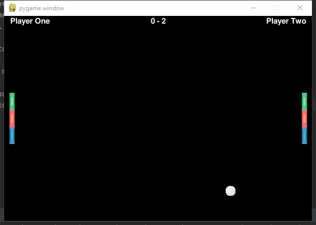

# Ping Pong Game

This is a ping pong game simulator, it's made with pygame, it's less accurate with angles since pygame  
does not offer rectangle surface with degrees, the turtle library does provide angles in radians, but this  
project is to practice the use of pygame.

Some game features:

* Two player playing on each side, who ever gets the winning score, win.
* When game is over, press space key to start again.
* The ball will move faster every time the player scores.

In order to run the game:

* Execute main.py

Demonstration: 

Picture source site:
www.flaticon.com